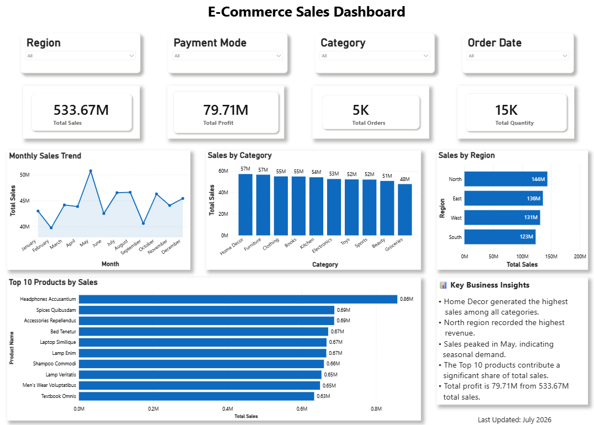
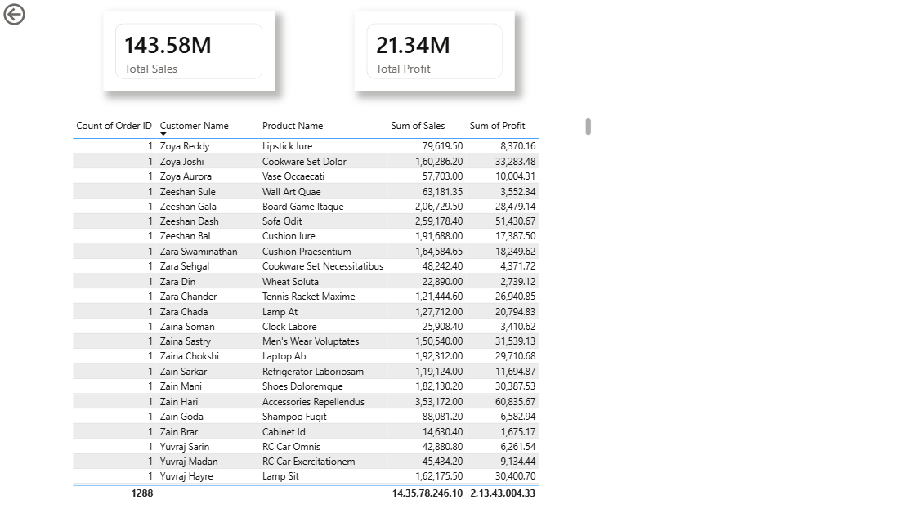
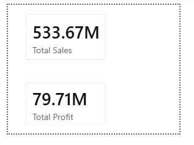

# 📊 E-Commerce Sales Dashboard - Power BI
Interactive Power BI Dashboard for E-Commerce Sales Analysis

An interactive Power BI dashboard built to analyze E-Commerce sales performance. This project provides business insights through KPIs, interactive visualizations, drill-through reports, custom tooltips, and dynamic filtering.

---

## 🚀 Project Overview

This dashboard helps business users monitor:

- Total Sales
- Total Profit
- Total Orders
- Total Quantity
- Monthly Sales Trend
- Sales by Category
- Sales by Region
- Top 10 Products by Sales

Interactive slicers allow users to filter the dashboard by:

- Region
- Payment Mode
- Category
- Order Date

---

## 📸 Dashboard Preview

### Main Dashboard



---

### Region Details (Drill-through)



---

### Tooltip Page



---

## 📈 Business Insights

- 🏆 Home Decor generated the highest sales among all categories.
- 🌍 North region recorded the highest revenue.
- 📅 Sales peaked during May, indicating seasonal demand.
- 📦 Top-selling products contributed significantly to total sales.
- 💰 Total Profit: **79.71M**
- 💵 Total Sales: **533.67M**

---

## 🛠 Tools & Technologies

- Power BI Desktop
- Microsoft Excel
- Power Query
- DAX
- Data Modeling
- Data Visualization

---

## ✨ Features

- Interactive KPI Cards
- Dynamic Slicers
- Monthly Sales Trend Analysis
- Category-wise Sales Analysis
- Region-wise Performance
- Top 10 Products Analysis
- Drill-through Report
- Custom Tooltip Page
- Business Insights Section

---

## 📂 Files Included

```
E-Commerce-Sales-Dashboard-PowerBI/
│
├── Images/
│   ├── Dashboard.png
│   ├── Region_Details.png
│   └── Tooltip_page.png
│
├── E_Commerce_Sales_Dashboard.pbix
├── E_Commerce_Sales_Data.xlsx
└── README.md
```

---

## 🎯 Key Skills Demonstrated

- Data Cleaning
- Data Modeling
- Dashboard Design
- KPI Reporting
- Business Intelligence
- Interactive Reporting
- Data Visualization
- Power Query
- DAX Fundamentals

---

## 👩‍💻 Author

**Swetha Gummidi**

Aspiring Data Analyst passionate about transforming data into meaningful business insights using Power BI, SQL, Excel, and Python.

GitHub: https://github.com/Swetha11102003

---

⭐ If you found this project useful, consider giving it a star!
